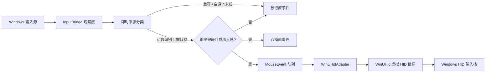

# HID-Mouse v1 系统架构

状态：`PROPOSED`  
关联需求：[requirements.md](requirements.md)

## 1. 总体数据流



InputBridge 是本项目内部模块名称，不引入额外的输入过滤驱动。它组合公开的
Win32 观察接口，但必须承认这些接口之间的信息不对称：低级鼠标钩子可以阻止
事件，却没有 Raw Input 的设备句柄；Raw Input 可以区分设备，却不能全局阻止
事件。因此来源判定只能使用在钩子返回前已经可靠获得的证据。

不得为了提高转换率而同步等待 Raw Input、猜测未来事件或让钩子执行阻塞 I/O。

## 2. 模块边界

| 模块 | 职责 | 不负责 |
| --- | --- | --- |
| `cli` | 解析 `doctor`、`probe`、`run`，输出诊断和退出码。 | 输入策略和 Win32 钩子。 |
| `platform` | 管理员、系统版本、交互桌面和会话检查。 | 提权或切换会话。 |
| `winuhid_adapter` | 安全加载 DLL、检查 ABI、创建鼠标、发送报告、清理。 | 驱动安装和更新。 |
| `input_bridge` | 消息循环、`WH_MOUSE_LL`、Raw Input 观察、触控提升标记读取。 | 目标窗口识别。 |
| `source_classifier` | 将即时证据映射为稳定来源类别和置信状态。 | 猜测未知来源。 |
| `forwarding_policy` | 根据来源类别输出 `PASS` 或 `CONVERT`。 | 目标应用特例。 |
| `mouse_state` | 规范化移动、按钮、滚轮和取消事件，维护按钮状态。 | Windows 命中测试。 |
| `safety_controller` | 后端健康、队列容量、紧急旁路、退出清理。 | 自动重启程序。 |
| `diagnostics` | 结构化、人可读日志和 probe 采样。 | 记录目标应用或键盘内容。 |

## 3. WinUHid 集成

采用官方 `cgutman/WinUHid`，固定到经过审查的提交。依赖以 Git submodule
放在 `third_party/WinUHid`，但普通应用构建只构建：

- `WinUHid/WinUHid.vcxproj`
- `WinUHidDevs/WinUHidDevs.vcxproj`

不构建 Driver、Installer、UnitTests 或其他示例。CMake 通过受控的 MSBuild
步骤产生 `WinUHid.dll`、`WinUHidDevs.dll` 和相应导入库；最终运行目录携带两个
用户态 DLL，但不携带驱动安装包。

应用使用绝对的程序目录和安全 DLL 搜索标志动态加载依赖，而不是让进程在进入
`main` 前因缺少 DLL 而被系统加载器终止。适配器依次验证核心 API、驱动接口
版本和鼠标 helper 导出，以便 `doctor` 给出明确错误。

首选的鼠标 helper API：

- `WinUHidMouseCreate`
- `WinUHidMouseReportMotion`
- `WinUHidMouseReportButton`
- `WinUHidMouseReportScroll`
- `WinUHidMouseDestroy`

## 4. 规范化事件

```cpp
enum class MouseEventKind {
    relative_motion,
    button,
    wheel,
    cancel,
};

struct MouseEvent {
    MouseEventKind kind;
    std::int32_t dx;
    std::int32_t dy;
    MouseButton button;
    bool pressed;
    std::int32_t wheel_x;
    std::int32_t wheel_y;
    SourceClass source;
    std::uint64_t sequence;
};
```

实际实现可以调整字段布局，但不得改变以下语义：移动在输出边界转换为 WinUHid
支持的有符号 16 位相对分段；按钮状态不能依赖单个瞬时事件；滚轮单位保持
Windows 的 120 分度语义；`cancel` 必须产生中立报告。

## 5. 并发和时序

进程仍是单个前台程序，但允许内部线程：

1. 消息循环线程拥有隐藏的 message-only window、Raw Input 注册和低级钩子。
2. 输出线程从有界、预分配队列读取规范化事件并调用 WinUHid。
3. 钩子回调只读取原子状态、分类、尝试非阻塞入队并立即返回；不得写文件、
   分配无界内存或等待输出完成。

“不允许后台进程”表示不得派生守护进程、服务或独立 helper；不禁止前台程序
内部为满足 Win32 钩子时限而使用受控线程。

## 6. 安全状态机

```text
STARTING
  -> BACKEND_READY
  -> SAFETY_READY
  -> OBSERVING
  -> FORWARDING

任意状态 --失败--> BYPASSING -> STOPPING -> STOPPED
```

- 只有 `FORWARDING` 可以吞输入。
- 后端不健康或队列无法接收时，钩子必须放行原事件。
- 进入 `BYPASSING` 时先原子禁止吞输入，再请求中立报告和清理。
- 清理顺序：禁止吞输入、卸载钩子、发送中立报告、销毁虚拟鼠标、卸载 DLL。
- 无法捕获强制终止、断电或内核故障；因此不承诺这些情况下执行用户态清理。

## 7. 已知技术边界

### 来源识别不是统一契约

`MSLLHOOKSTRUCT` 提供注入标志和 `dwExtraInfo`，Raw Input 提供设备句柄，两者
没有公开的共同事件 ID。`probe` 必须验证每种来源实际暴露的证据，禁止仅按时间
和坐标进行未经验证的强匹配。

### RDP 和第三方远控

Windows 没有为所有远控实现提供统一、公开且稳定的事件来源标志。Sunshine 也
可能随输入后端和客户端模式改变表现。无法可靠识别时按 `unknown` 放行；若这使
验收场景失败，当前用户态架构的 Gate 2 必须暂停，而不是加入目标应用特例。

### 自身虚拟设备回声

Raw Input 可以验证虚拟设备身份，但钩子回调未必能在阻止决策前得到该身份。
严格策略下，自身 HID 输出通常表现为非注入的兼容 HID 并被放行；这个假设必须
通过 probe 和闭环测试验证。验证失败时不得启用“转换全部鼠标”策略。

## 8. 计划中的仓库结构

```text
HID-Mouse/
├── CMakeLists.txt
├── cmake/
│   └── WinUHid.cmake
├── docs/
├── include/hid_mouse/
├── src/
│   ├── cli/
│   ├── input/
│   ├── output/
│   ├── safety/
│   └── main.cpp
├── tests/
│   ├── unit/
│   └── integration/
└── third_party/
    └── WinUHid/          # Git submodule，实施获批后才添加
```
